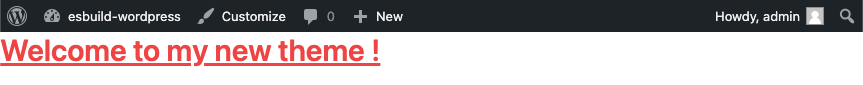

# esbuild Wordpress



Features:

- wp-env to create a Wordpress dev Docker environment
- ESBuild dev & production config
- PostCSS, TailwindCSS support included

## Requirements

- Docker
- NodeJS

## Usage

### Theme development

### Start Wordpress dev environment

```sh
# Start Wordpress dev environment via Docker containers
npm run wp:start

# ESBuild watch mode to build your assets on the fly
npm run assets:dev
```

The local environment will be available at http://localhost:8888 (Username: admin, Password: password).

### Finalize Theme

```sh
# Build with optimization your assets for production
npm run assets:build
```

### How to add theme with esbuild handling

Let's add a new theme named "mysupertheme"

```sh
# Create a new theme folder
mkdir wp-themes/mysupertheme
```

In `.wp-env.json`, add "mysupertheme" in the `themes` array:

```json
{
  "themes": ["mysupertheme"]
}
```

In `esbuild.js`, add a new entry for "mysupertheme":

```js
// esbuild.js
const themeNames = ["mysupertheme"];
```

## Backup

docker cp {wp_container_name}:/var/www/html backup

## ACF

https://www.advancedcustomfields.com/resources/local-json/

## Related documentations

- Theme development: https://codex.wordpress.org/Theme_Development

- .wp-env.json: https://developer.wordpress.org/block-editor/reference-guides/packages/packages-env/#wp-env-json

- @wordpress-env: https://github.com/wordpress/gutenberg
